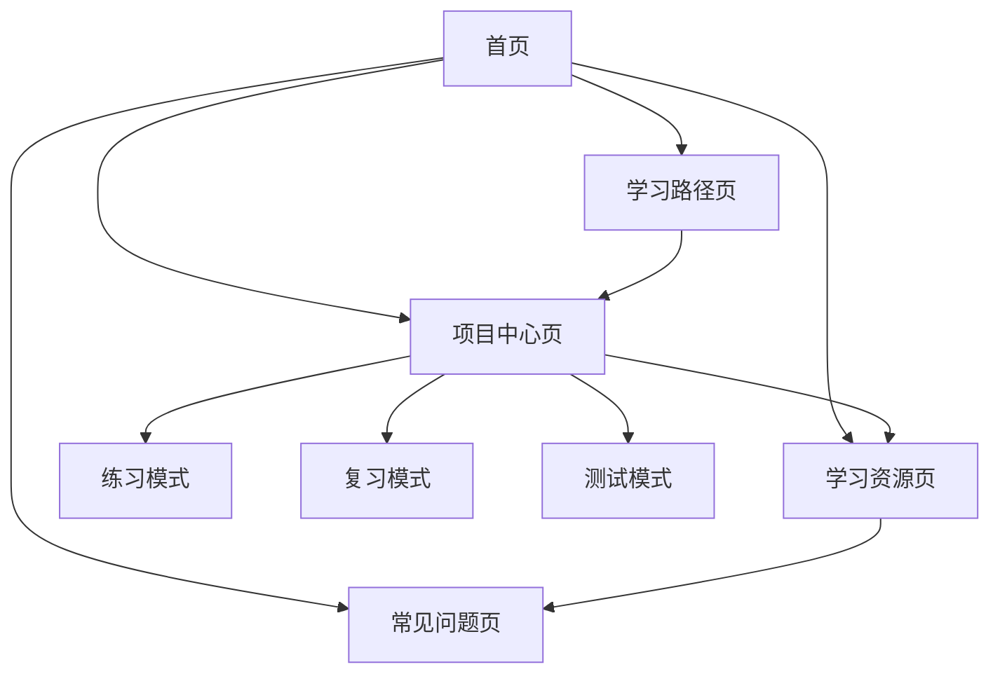

## 1. Product Overview
数据分析技术实战训练营教学平台，提供完整的数据分析课程内容和项目实战环境。
- 为零基础学生、职场入门者和数据分析爱好者提供系统化的学习路径
- 目标是帮助用户掌握Python数据分析全流程，独立完成10个商业实战项目

## 2. Core Features

### 2.1 User Roles
| 角色 | 注册方式 | 核心权限 |
|------|----------|----------|
| 学习者 | 无需注册 | 浏览所有课程内容、查看项目详情、使用学习资源 |

### 2.2 Feature Module
1. **首页**：课程介绍、核心亮点、学习路径概览、课程优势
2. **学习路径页**：分阶段学习内容、对应项目、学习目标、核心技能点
3. **项目中心页**：10个项目列表、项目详情、练习/复习/测试选项卡
4. **学习资源页**：数据集资源、代码模板资源、知识点文档、工具推荐
5. **常见问题页**：按类别分类的常见问题及解答

### 2.3 Page Details
| 页面名称 | 模块名称 | 功能描述 |
|---------|---------|----------|
| 首页 | Banner区 | 展示课程slogan和核心亮点标签 |
| 首页 | 课程定位区 | 明确课程面向人群和课程目标 |
| 首页 | 学习路径概览区 | 展示横向流程图，标注各阶段对应项目 |
| 首页 | 课程优势区 | 卡片式展示课程4大优势 |
| 学习路径页 | 阶段详情区 | 分阶段详细拆解学习内容、项目、目标和技能点 |
| 项目中心页 | 项目列表导航 | 左侧10个项目列表，可点击切换右侧内容 |
| 项目中心页 | 项目详情区 | 展示项目标题、核心任务、数据集信息 |
| 项目中心页 | 选项卡切换 | 练习/复习/测试三选项卡内容切换 |
| 学习资源页 | 资源分类展示 | 分类展示数据集、代码模板、知识点文档、工具推荐 |
| 学习资源页 | 详情展开 | 点击卡片展开资源详情 |
| 常见问题页 | 问题分类展示 | 按问题类型分类展示常见问题 |
| 常见问题页 | 答案展开 | 点击问题展开答案详情 |

## 3. Core Process
用户浏览课程内容 → 查看学习路径 → 选择项目进行练习/复习/测试 → 使用学习资源辅助学习 → 查看常见问题获取帮助

## 4. User Interface Design
### 4.1 Design Style
- 主色：`#335C81`（深蓝色）
- 辅助色：`#8FA6CB`（浅蓝色）
- 中性色：`#F5F7FA`（浅灰）、`#2C3E50`（深灰）、`#E8EEF2`（超浅灰）
- 按钮风格：圆角矩形，主按钮使用主色，次要按钮使用浅灰色
- 字体：正文使用微软雅黑，标题加粗，代码模块使用等宽字体（Consolas）
- 布局风格：卡片式布局，顶部固定导航栏，内容区域分区明确
- 图标风格：简洁线条图标，专业教学风格

### 4.2 Page Design Overview
| 页面名称 | 模块名称 | UI元素 |
|---------|---------|--------|
| 首页 | Banner区 | 大标题+核心亮点标签，使用主色强调，背景为浅灰色 |
| 首页 | 课程定位区 | 卡片式布局，清晰的文字说明，使用中性色 |
| 首页 | 学习路径概览区 | 横向流程图，使用主色和辅助色区分阶段，标注项目序号 |
| 首页 | 课程优势区 | 4个卡片，hover效果轻微提亮，使用图标+文字组合 |
| 学习路径页 | 阶段详情区 | 分阶段卡片，每个阶段包含项目列表、学习目标和技能点 |
| 项目中心页 | 项目列表导航 | 左侧固定宽度，当前项目高亮显示，使用主色背景 |
| 项目中心页 | 项目详情区 | 右侧内容区域，顶部显示项目信息，下方为选项卡 |
| 项目中心页 | 选项卡切换 | 选项卡使用主色和浅灰色区分选中状态 |
| 学习资源页 | 资源分类展示 | 卡片式布局，分类清晰，点击展开详情 |
| 常见问题页 | 问题分类展示 | 折叠面板风格，点击展开答案 |

### 4.3 Responsiveness
- 设计采用电脑端优先原则
- 适配常见桌面分辨率（1280px及以上）
- 确保课堂演示时文字清晰易读
- 无移动端适配要求

### 4.4 3D Scene Guidance
- 不适用3D场景
