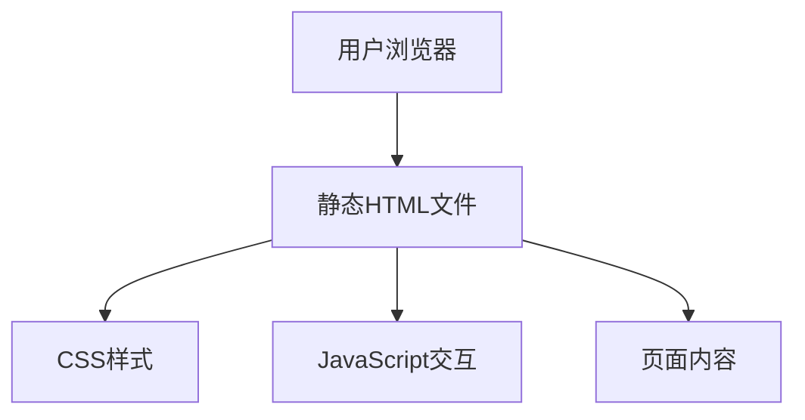

## 1. Architecture Design

## 2. Technology Description
- 前端：纯HTML5 + CSS3 + 原生JavaScript
- 无需后端服务
- 无需数据库
- 无需外部依赖

## 3. Route Definitions
| 路由 | 目的 |
|------|------|
| #home | 首页，展示课程介绍和核心亮点 |
| #path | 学习路径页，展示分阶段学习内容 |
| #projects | 项目中心页，展示10个项目及其详情 |
| #resources | 学习资源页，展示各类学习资源 |
| #faq | 常见问题页，展示常见问题及解答 |

## 4. API Definitions
- 无API需求，所有内容均为静态

## 5. Server Architecture Diagram
- 无服务器架构需求

## 6. Data Model
- 无数据模型需求，所有内容均为静态

## 7. 技术实现要点
1. **页面结构**：使用HTML5语义化标签，构建清晰的页面结构
2. **样式设计**：使用CSS3实现响应式布局，遵循设计规范
3. **交互功能**：使用原生JavaScript实现页面切换、选项卡切换、卡片展开等交互
4. **代码组织**：将CSS和JS代码内嵌到HTML文件中，确保单文件交付
5. **性能优化**：优化CSS选择器，减少DOM操作，确保页面加载流畅
6. **兼容性**：确保在主流浏览器中正常显示和运行
